# InGra – Datenbankkonzept

## Struktur

Das Datenbankschema ist in drei Bereiche aufgeteilt:

- **Core** – Kategorien, Subkategorien und Produkte
- **Preise** – Shops und Preisverlauf
- **Specs** – Produktspezifische Tabellen je Kategorie

---

## ER-Diagramm

```mermaid
erDiagram

    %% ==================
    %% CORE
    %% ==================

    category {
        int id PK
        varchar name
        varchar slug
    }

    subcategory {
        int id PK
        int category_id FK
        varchar name
        varchar slug
    }

    product {
        int id PK
        int category_id FK
        int subcategory_id FK
        varchar name
        varchar manufacturer
        varchar model
        varchar image_url
        varchar product_url
        datetime created_at
        datetime updated_at
    }

    %% ==================
    %% PREISE
    %% ==================

    shop {
        int id PK
        varchar name
        varchar base_url
    }

    price {
        int id PK
        int product_id FK
        int shop_id FK
        float price
        datetime scraped_at
    }

    %% ==================
    %% SPECS
    %% ==================

    gpu_specs {
        int id PK
        int product_id FK
        int vram_gb
        varchar vram_type
        int memory_bus
        int base_clock_mhz
        int boost_clock_mhz
        int tdp_watt
        varchar pcie_version
        varchar connectors
        int length_mm
        int cooling_slots
    }

    cpu_specs {
        int id PK
        int product_id FK
        varchar socket
        int cores
        int threads
        float base_clock_ghz
        float boost_clock_ghz
        int tdp_watt
        int l3_cache_mb
        varchar memory_type
        boolean integrated_graphics
        boolean includes_cooler
    }

    mainboard_specs {
        int id PK
        int product_id FK
        varchar socket
        varchar chipset
        varchar form_factor
        int memory_slots
        varchar memory_type
        int max_memory_gb
        int pcie5_slots
        int m2_slots
        boolean usb_c_rear
        boolean wifi
        boolean bluetooth
    }

    psu_specs {
        int id PK
        int product_id FK
        int watt
        varchar efficiency_rating
        varchar modular
        varchar form_factor
        boolean atx3
        int pcie16_connectors
    }

    ram_specs {
        int id PK
        int product_id FK
        varchar memory_type
        int capacity_gb
        int kit_count
        int speed_mhz
        int cl_latency
        float voltage
        boolean rgb
    }

    storage_specs {
        int id PK
        int product_id FK
        int capacity_gb
        varchar interface
        varchar form_factor
        int read_mbps
        int write_mbps
        int tbw
        boolean dram_cache
    }

    air_cooler_specs {
        int id PK
        int product_id FK
        int height_mm
        int tdp_watt
        int fan_count
        int fan_size_mm
        varchar socket_support
        boolean rgb
    }

    case_fan_specs {
        int id PK
        int product_id FK
        int size_mm
        int max_rpm
        float max_airflow_cfm
        float static_pressure
        varchar connector
        boolean rgb
    }

    watercooling_cpu_specs {
        int id PK
        int product_id FK
        varchar socket_support
        int pump_speed_rpm
        boolean rgb
    }

    aio_specs {
        int id PK
        int product_id FK
        int radiator_size_mm
        int fan_count
        int fan_size_mm
        varchar socket_support
        int tubing_length_mm
        boolean rgb
    }

    radiator_specs {
        int id PK
        int product_id FK
        int size_mm
        int thickness_mm
        int fan_slots
        int fan_size_mm
        varchar material
    }

    gpu_watercooling_specs {
        int id PK
        int product_id FK
        varchar compatible_gpus
        varchar material
        boolean rgb
    }

    fitting_specs {
        int id PK
        int product_id FK
        varchar type
        varchar thread
        varchar material
        varchar color
    }

    tubing_specs {
        int id PK
        int product_id FK
        varchar type
        float inner_diameter_mm
        float outer_diameter_mm
        varchar material
        float length_m
        varchar color
    }

    %% ==================
    %% RELATIONEN
    %% ==================

    category ||--o{ subcategory : "hat"
    category ||--o{ product : "hat"
    subcategory ||--o{ product : "hat"

    product ||--|| gpu_specs : "hat"
    product ||--|| cpu_specs : "hat"
    product ||--|| mainboard_specs : "hat"
    product ||--|| psu_specs : "hat"
    product ||--|| ram_specs : "hat"
    product ||--|| storage_specs : "hat"
    product ||--|| air_cooler_specs : "hat"
    product ||--|| case_fan_specs : "hat"
    product ||--|| watercooling_cpu_specs : "hat"
    product ||--|| aio_specs : "hat"
    product ||--|| radiator_specs : "hat"
    product ||--|| gpu_watercooling_specs : "hat"
    product ||--|| fitting_specs : "hat"
    product ||--|| tubing_specs : "hat"

    product ||--o{ price : "hat"
    shop ||--o{ price : "hat"
```

---

## Kategorien & Subkategorien

| Kategorie | Subkategorien | Spec-Tabelle |
|---|---|---|
| GPU | – | `gpu_specs` |
| CPU | – | `cpu_specs` |
| Mainboard | – | `mainboard_specs` |
| Netzteil | – | `psu_specs` |
| RAM | – | `ram_specs` |
| Festplatten | SSD, NVMe | `storage_specs` |
| Kühlung | CPU Luftkühler | `air_cooler_specs` |
| Kühlung | Gehäuselüfter | `case_fan_specs` |
| Kühlung | CPU Wasserkühlung | `watercooling_cpu_specs` |
| Kühlung | AIO | `aio_specs` |
| Kühlung | Radiator | `radiator_specs` |
| Kühlung | GPU Wasserkühlung | `gpu_watercooling_specs` |
| Kühlung | Fittings | `fitting_specs` |
| Kühlung | Rohre & Schläuche | `tubing_specs` |
